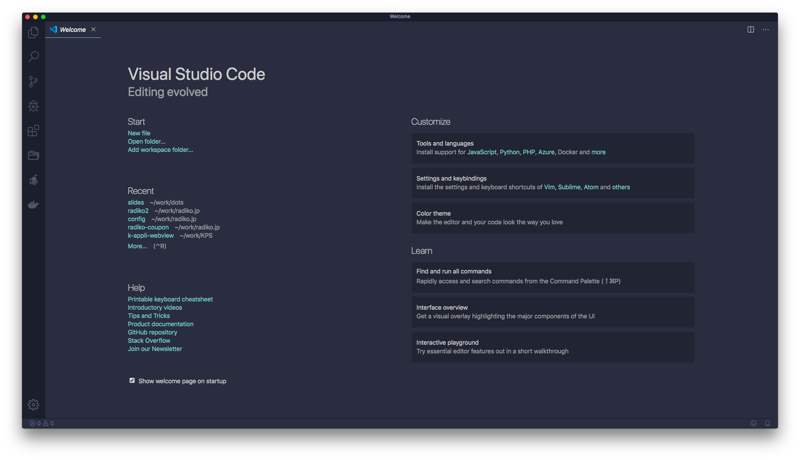

# Webの技術でできること

---

## 自己紹介

- 名前: 紀野 友宏
- 入社: 2018/4~
- 前職までは主にPHP、入社後は主にフロント（JS）

---

## Webの技術（主にJS）で何ができる？

- 動き/機能を持ったサイト作成
- デスクトップアプリ作成
- モバイルアプリ作成
- スマートスピーカーのスキル作成

---

## 動き/機能を持ったサイト作成

---

イメージつくと思うので省略

---

## デスクトップアプリ作成

---

---

## モバイルアプリ作成

---

## スマートスピーカーのスキル作成
